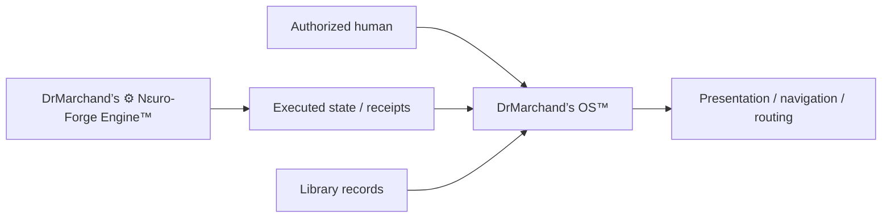

# DrMarchand’s OS™

> The presentation, navigation, routing, and lifecycle-state layer surrounding the Design Orchard / DrMarchand system.

**Repository coordinate:** `DrMarchand/DrMarchand-OS` · **Public documentation surface** · **Execution remains separate**

## Identity rule

The published system name is **DrMarchand’s OS™**.

| Expression | Meaning |
| --- | --- |
| `DrMarchand’s OS™` | Current system identity |
| `Infinity OS` / `Infinite OS` | Superseded aliases; replace in current prose |
| `∞` | Infinite-bridge architecture inside the system, not the system name |
| local production markers | Private; they do not belong on GitHub public surfaces |
| `DrMarchand-OS` | Stable repository / machine coordinate |

Machine identifiers and historical evidence may retain compatibility spellings where changing them would break a real path, API, database, or reference. They must be labeled as coordinates, not promoted as current names.

## Purpose

- presents system state without claiming execution;
- routes users and interfaces toward the correct operating surface;
- exposes lifecycle, release, and relationship context;
- keeps public presentation separate from private implementation;
- consumes validated identity and relationship information from authoritative sources.

## Architecture

**DrMarchand’s ⚙︎ Nɛuro-Forge Engine™ is not the OS.** The Engine executes and orchestrates within delegated permission; the OS presents and routes the resulting state.

## Registry map

- [`registry/CORE_ARCHITECTURE.md`](registry/CORE_ARCHITECTURE.md) - repository architecture and boundaries.
- [`registry/decisions.md`](registry/decisions.md) - append-only architectural decisions and supersession records.
- [`registry/glossary.md`](registry/glossary.md) - compact terminology map.
- [`registry/concepts/`](registry/concepts/) - long-form concept records.
- [`schemas/mysql/neuro_forge_engine/2026_07_05_atlas_runtime_seed.sql`](schemas/mysql/neuro_forge_engine/2026_07_05_atlas_runtime_seed.sql) - historical Atlas runtime seed; presence does not prove deployment.
- [`protocols/`](protocols/) - protocol documents where present.

The Registry is a versioned engineering record. It does not grant legal authority or prove deployed runtime state by itself.

## Validation

Current validation is documentation- and schema-oriented. No single repository command is documented as a universal OS runtime because this repository does not prove one supported executable path. Validate identity, links, schema intent, and boundary claims against the exact artifact being changed.

## Public boundary

Do not publish credentials, private storage topology, private device identity, unpublished production markers, or internal host details here. Bridge implementations and execution credentials live outside the public OS repository.

## Authority and rights

**Legal and operating company:** Design Orchard LLC  
**Operating environment:** 🔬 DrMarchand’s Lab⚛︎ratory™

See [`RIGHTS.md`](RIGHTS.md) and [`LICENSE.md`](LICENSE.md) for repository-specific rights and license terms. Final promotion remains an authorized-human decision supported by evidence.
