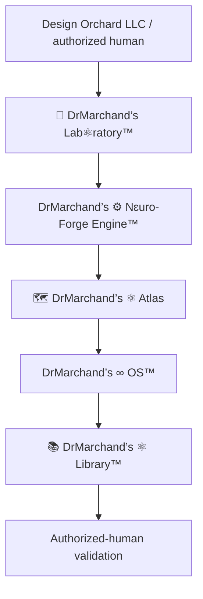

# DrMarchand’s ∞ OS™

> The public presentation, navigation, and interaction layer for the Design Orchard ecosystem.

## Purpose

DrMarchand’s ∞ OS™ presents registered state, exposes navigable relationships, and routes authorized user intent toward bounded execution. It does not create legal authority, decide truth, or execute work independently.

## Registry model

The operating boundary assigns one responsibility to each registered layer.

| Layer | Responsibility |
|---|---|
| `Design Orchard LLC` and authorized human | Legal authority, delegation, approval, and final validation |
| `🔬 DrMarchand’s Lab⚛︎ratory™` | Delegated research and build context |
| `DrMarchand’s ⚙︎ Nɛuro-Forge Engine™` | Bounded execution, automation, and validation |
| `🗺️ DrMarchand’s ⚛︎ Atlas` | Registered identity, relationship, and truth-state resolution |
| `DrMarchand’s ∞ OS™` | Presentation, navigation, and interaction |
| `📚 DrMarchand’s ⚛︎ Library™` | Permanent institutional record and custody |

## Repository map

| Surface | Purpose | Evidence |
|---|---|---|
| Architecture registry | Defines current responsibility and boundary language | [`registry/CORE_ARCHITECTURE.md`](registry/CORE_ARCHITECTURE.md) |
| Ecosystem map | Places the operating and creative namespaces | [`docs/canon/ecosystem-map.md`](docs/canon/ecosystem-map.md) |
| Atlas schema and seed | Defines versioned graph, infrastructure, binding, and truth-state records | [`schemas/mysql/neuro_forge_engine/2026_07_05_atlas_runtime_seed.sql`](schemas/mysql/neuro_forge_engine/2026_07_05_atlas_runtime_seed.sql) |

The SQL seed is a versioned technical artifact. Its presence—and the presence of database rows—does not by itself prove that a deployment is reachable, current, healthy, or authorized.

## Allowed behavior

DrMarchand’s ∞ OS™ may:

- present state registered through 🗺️ DrMarchand’s ⚛︎ Atlas;
- visualize lifecycle, evidence, and validation status;
- accept authorized user interaction;
- route requests toward DrMarchand’s ⚙︎ Nɛuro-Forge Engine™ through explicit interfaces;
- display observations from 🪬 Big Brother without converting them into authority.

DrMarchand’s ∞ OS™ must not:

- declare itself the legal, organizational, execution, or truth authority;
- execute deployments, mutations, or approvals by presentation alone;
- overwrite permanent Library records;
- treat a schema, seed, screenshot, or successful command as broader runtime proof;
- absorb an external Bridge into the Engine or carry authority across it.

## Public build family

The public build is:

`DrMarchand’s ∞ OS™ [Lionheart, Phoenix, Panther, Timberwolf, Sabertooth]`

The private `♾️ OS™` build and its Guardian family are separate and are not aliases for this public build.

## Validation and evidence

This repository currently exposes architecture records and SQL artifacts. No root package manifest or verified application startup command was observed during the July 2026 inspection, so this README does not claim a runnable OS deployment.

GitHub preserves versioned engineering artifacts. 🗺️ DrMarchand’s ⚛︎ Atlas resolves registered truth. 📚 DrMarchand’s ⚛︎ Library™ preserves approved records. Authorized-human validation closes the gate.

## Authority

Legal authority: `Design Orchard LLC`  
Copyright attribution: `© Design Orchard LLC`

External services connect through explicit Bridges. A Bridge does not transfer authority, merge namespaces, or become an internal Engine component.
